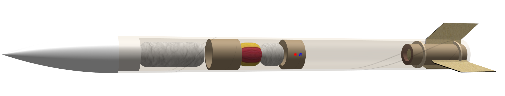

# Rocket

Model rocket project. Both CAD for the rocket itself and hardware and software for the flight computer.

## Rocket Specifications

The current design is a single stage D class rocket with an theoretical approximate apogee of 280m.

## Flight computer

### Software

The software stack uses the CMSIS wrapper with platform IO. This is done to allow for easy change between various controllers.

### Hardware

The current flight computer focuses on data acquisition with limited control. Its design is based around the STM32F1 or F4 series of microcontrollers.
